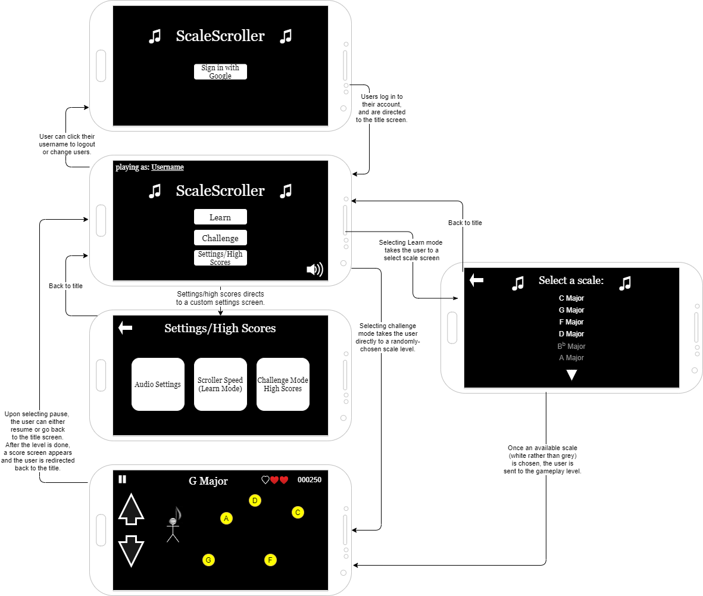

## Summary

ScaleScroller is a game that allows the user to learn or practice their musical scales. The user controls their character to move up and down to collect coins. Each level uses a different musical scale, and coins are labeled with either correct musical note names found in that scale or with incorrect note names. Collecting correct coins adds points, but collecting an incorrect coin takes away one of three in-game lives.

Learn mode allows the user to start with the easiest scales and gradually teaches them all of the common musical scales. Challenge mode allows the user to test their knowledge: any scale can appear at any point, and the sidescroller progressively gets faster and faster as they go on.

## Intended users

* Someone who wants to learn the basics of music theory

    > I've never studied written music before, but I would like to learn. The learn mode of this app gradually teaches me scales in the form of a fun game, so I don't get bored with rote memorization.

* Someone who needs to practice their music theory knowledge

	> As a Theory 1 student at UNM, my professor expects me to not just know how to figure out scales, but to do it very quickly. The challenge mode of this app lets me practice scales quickly and gives me immediate feedback on the wrong notes - and my grade has already started going up!

## Functionality

* For each level, the app displays a scale name and its notes for several seconds.

* The sidescroller starts, and the user can control their character (represented as an eighth note) to move up and down.

	* The objective is to collect (run over) the coins labeled with correct notes, and avoid coins labeled with incorrect notes.

	* Correct notes add points, while incorrect notes take away lives. There are three lives total.

	* To beat the level, the user must get a certain amount of points/go for a certain amount of time without losing all three lives.

* Once the level has been beaten, the user is asked whether to play again or to go to the next level, with a new scale. 

* Learn mode is the standard mode. This mode starts with C Major and progresses around the circle of fifths with each level, gradually increasing difficulty. In learn mode, the user must beat the level in order to progress; otherwise, the current level is repeated. This allows for practicing and learning each scale.

* Challenge mode is more difficult, and works best when the user has already progressed through learn mode to learn most or all of their scales. In challenge mode, any scale can appear at any point. The speed of the sidescroller progressively gets faster as the user beats more levels. Once the game has ended, the score is added to a high score board, if applicable.

* Settings:

	* Change set of allowed scales
	
	* Change between learn mode and challenge mode
	
	* Change speed of sidescroller

## Persistent data

* Settings

* Learn mode level reached

* Challenge mode high score board
    
## Device/external services

* Device audio, accessed through MediaPlayer [(overview)](https://developer.android.com/guide/topics/media/mediaplayer) [(documentation)](https://developer.android.com/reference/android/media/MediaPlayer)

	* Audio played through MediaPlayer enhances the game with music and sound effects. For example, when an incorrect coin is picked up, a sound effect is part of the indication of the mistake.

	* Audio is not critical to the functionality of the app, and can be turned off if desired.

* Google Sign-in [(documentation)](https://developers.google.com/identity/sign-in/android/start-integrating)

	* Sign-in will let the user associate their data with a username and account.
	
	* Sign-in is not required to play the game or to save local data.  

## Stretch goals/possible enhancements 

* Allow the user to unlock new playable characters (whole note, quarter note, dotted notes, rests, etc.) as they progress through the game.

* Allow for selection of different color themes.

* Allow the user to input their own custom collections (octatonic, wholetone, jazz modal scales, etc.).

* Chord mode: collections of correct notes are smaller (three or four possibilities each), “levels” are much shorter, and transitions between levels are very fast. This trains the user to quickly switch between chords.

* Global and regional leaderboards for challenge mode; group leaderboards for classes, accessible by teachers

* Listen mode: allow the user to control the character not by up/down on the screen, but by accessing the microphone. The user can use their instrument or voice to play the notes required to collect the correct coins.

	* Include transposition settings for clarinet, etc.
	
	* Allow user-submitted “songs” (series of notes) to “play”
	
* Rhythm mode: instead of a pitch collection, the user is shown a time signature. They must collect coins that fill up a measure's worth of rhythmic values, then collect a barline coin, then repeat.

## Wireframe

